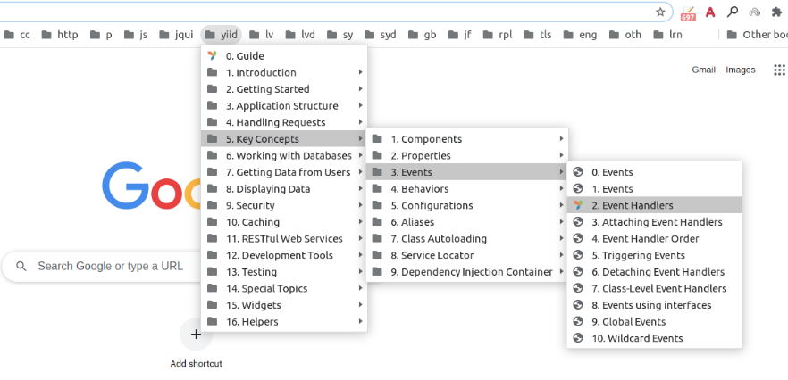

# yii2-doc-bookmarks

- [Download](#download)
- [Installation](#installation)
- [Usage](#usage)



## Download

Your can download the latest bookmarks on the following site: https://data.grinvik.com.

## Installation

``` sh
composer require w3lifer/yii2-doc-bookmarks
```

## Usage

- Create `yii2-doc-bookmarks.php` file with the following content:

``` php
<?php

use w3lifer\yii2\DocBookmarks;

$docBookmarks = new DocBookmarks();

file_put_contents(
    __DIR__ . '/yii2-doc-bookmarks-as-array.php',
    '<?php' . "\n\n" .
        var_export($docBookmarks->getAsArray(), true) . ';'
);

file_put_contents(
    __DIR__ . '/yii2-doc-bookmarks-as-netscape-bookmarks.html',
    $docBookmarks->getAsNetscapeBookmarks()
);

echo 'Done!' . "\n";
```

- Run it from the command line to get two files with bookmarks:

``` sh
php yii2-doc-bookmarks.php
```

---

- Run `vendor/bin/yii2-doc-bookmarks` to get `yii2-doc-bookmarks-as-array.php` and `yii2-doc-bookmarks-as-netscape-bookmarks.html` in the parent directory of the `vendor` directory.
